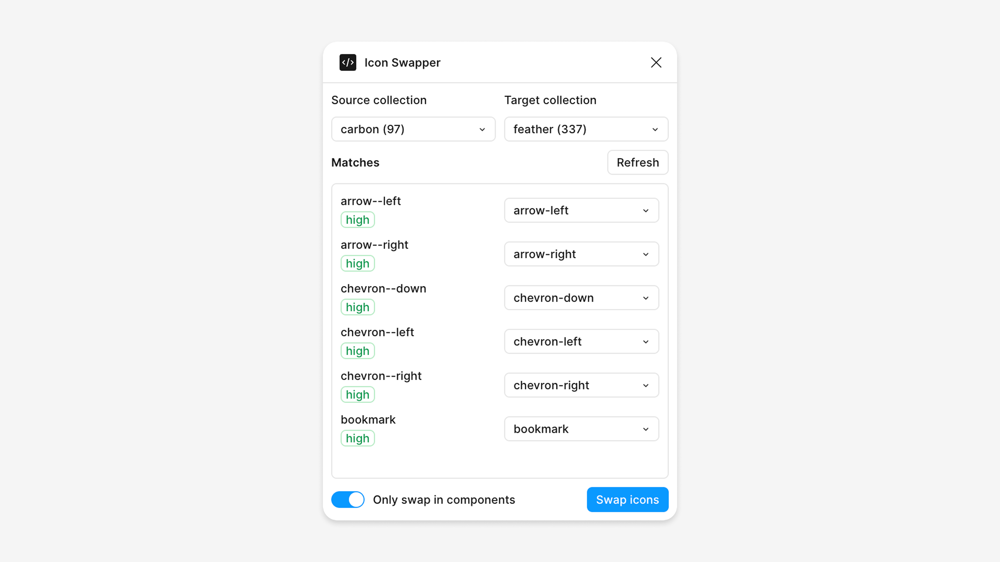

# Icon Swapper

A Figma plugin that swaps icon components from one collection to another, with smart name matching and confidence scoring.

## Features

- **Smart Icon Matching** - Automatically matches icons between collections using intelligent name comparison
- **Synonym Support** - Recognizes common icon name synonyms (e.g., "view" ↔ "eye", "close" ↔ "x")
- **Confidence Scoring** - Shows match confidence levels (high, medium, low) to help you review suggestions
- **Collection Management** - Scans and manages multiple icon collections from your icons page
- **Flexible Swapping** - Option to swap only icons inside components or across the entire page
- **Usage Detection** - Analyzes which icons are actually being used in your design
- **Clean UI** - Built with Svelte and Figma UI3 Kit for a native Figma experience

## How It Works

1. **Organize Your Icons** - Place your icon collections in frames on a page named `└ icons` (or any page with "icons" in the name)
2. **Select Collections** - Choose a source collection (the icons you want to replace) and a target collection (the new icons)
3. **Review Matches** - The plugin automatically matches icons based on their names and shows confidence levels
4. **Adjust if Needed** - Manually adjust any matches that don't look right
5. **Swap** - Click "Swap icons" to replace all instances across your design

## Getting Started

### Prerequisites

- Node.js 18+ 
- npm or yarn
- A Figma file with icon collections organized in frames

### Installation

1. Clone this repository
2. Install dependencies:
   ```bash
   npm install
   ```

3. Build the plugin:
   ```bash
   npm run build
   ```

4. Import the plugin in Figma:
   - Open Figma
   - Go to `Plugins > Development > Import Plugin from Manifest`
   - Select the `manifest.json` file from the `dist` directory

### Development

For development with hot reload:

```bash
npm run dev
```

Then enable "Hot reload plugin" in Figma's Plugin Development menu.

## Usage Guide

### Setting Up Your Icons Page

The plugin looks for a page named `└ icons` in your Figma file. Each **frame** on this page is treated as an icon collection:

```
└ icons (Page)
  ├── Heroicons (Frame)
  │   ├── check (Component)
  │   ├── x (Component)
  │   └── eye (Component)
  ├── Lucide Icons (Frame)
  │   ├── checkmark (Component)
  │   ├── close (Component)
  │   └── view (Component)
```

### Using the Plugin

1. **Open the Plugin** - Run "Icon Swapper" from the Plugins menu
2. **Select Source Collection** - Choose the icon set you're currently using
3. **Select Target Collection** - Choose the icon set you want to switch to
4. **Review Matches** - Check the automatically generated matches:
   - 🟢 **High confidence** - Strong name match (80%+ similarity)
   - 🟡 **Medium confidence** - Moderate match (50-79% similarity)
   - 🔴 **Low confidence** - Weak match (<50% similarity)
5. **Adjust Matches** - Use the dropdowns to manually select different target icons if needed
6. **Toggle Scope** - Enable "Only swap in components" to limit changes to icon instances within components
7. **Swap** - Click "Swap icons" to apply all changes

### Name Matching

The plugin uses intelligent name matching with several features:

- **Token Matching** - Breaks icon names into parts (e.g., "arrow-left-circle" → ["arrow", "left", "circle"])
- **Synonym Support** - Recognizes common variations:
  - `view` ↔ `eye`
  - `close` ↔ `x`
  - `remove` ↔ `trash`
  - `checkmark` ↔ `check`
  - `overflow` ↔ `more`
  - `warning` ↔ `alert`
- **Size Agnostic** - Ignores size variants (12, 16, 20, 24, 28, 32, 48)
- **Prefix Handling** - Strips collection name prefixes automatically

## Project Structure

```
├── src/
│   ├── code.ts          # Plugin logic: scanning, matching, swapping
│   ├── main.js          # UI entry point
│   ├── PluginUI.svelte  # Main UI component
│   ├── index.html       # HTML template
│   └── manifest.json    # Plugin configuration
├── dist/                # Built files (generated)
├── vite.config.ts       # Build configuration
└── package.json         # Dependencies and scripts
```

## Development

### Available Scripts

- `npm run build` - Build the plugin for production
- `npm run dev` - Build with watch mode for development
- `npm run lint` - Check code with ESLint and Prettier
- `npm run prettier` - Format code with Prettier

### Adding New Synonyms

To add more icon name synonyms, edit the `SYNONYMS` object in `src/code.ts`:

```typescript
const SYNONYMS: Record<string, string> = {
  view: "eye",
  eye: "view",
  // Add your own synonyms here
};
```

### Customizing the Icons Page Name

By default, the plugin looks for a page named `└ icons`. To change this, modify the constant in `src/code.ts`:

```typescript
const ICONS_PAGE_NAME = "└ icons";
```

## Building for Production

```bash
npm run build
```

This creates optimized files in the `dist/` directory ready for distribution or import into Figma.

## Tech Stack

- **Svelte** - Reactive UI framework
- **TypeScript** - Type-safe development
- **Vite** - Fast build tool
- **Figma UI3 Kit** - Figma UI3 design system components
- **Vitest** - Unit testing

## License

MIT License
