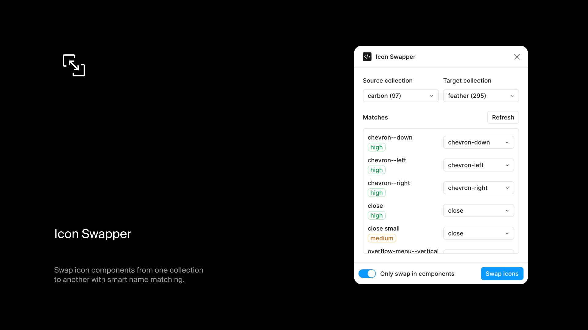

# Icon Swapper

A Figma plugin for swapping icon components from one collection to another with smart name matching.

## Install

Get it from the [Figma Community](https://www.figma.com/community/plugin/1597965780056553650/icon-swapper)

## What it does

Replaces icon instances across your design by matching icons between collections using intelligent name comparison, synonym support, and confidence scoring.

## Usage

1. Organize icon collections in frames on a page containing the word `icons`
2. Run the plugin
3. Choose the source collection (icons to replace) and the target collection (new icons) in the bar at the top
4. Choose where to swap: whole file, this page, or the selection
5. Review each source → target row; pick another target from the dropdown or untick rows to skip
6. Click Swap icons

## Matching features

- Token-based name matching that splits on dashes, underscores, slashes, spaces and dots (`icon.24.arrow-left` → `["arrow", "left"]`)
- Synonym recognition (`view` ↔ `eye`, `close` ↔ `x`, `check` ↔ `checkmark`)
- Size-agnostic matching (ignores 12, 16, 20, 24 and size words such as small or large)
- Words every icon in a set shares, such as `icon`, are left out of the comparison
- Confidence levels: high (80%+), medium (50-79%), low (<50%), shown as a badge on each target and on the suggestions in its menu

## Options

- **Scope** - Swap in the whole file, on the current page, or inside the selected layers. The plugin remembers your last choice
- **Only in components** - Limit changes to icon instances within components

## Development

```bash
npm install
npm run dev    # Watch mode
npm run build  # Production build
```
