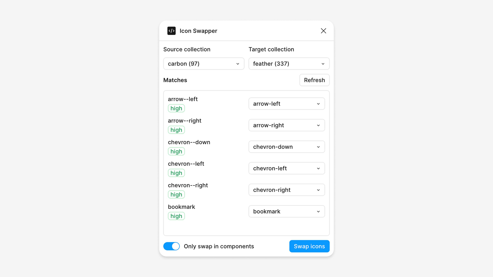

# Icon Swapper

Swap icon components from one collection to another with smart name matching.

## What it does

Replaces icon instances across your design by matching icons between collections using intelligent name comparison, synonym support, and confidence scoring.

## Usage

1. Organize icon collections in frames on a page containing the word `icons`
2. Run the plugin
3. Select source collection (icons to replace) and target collection (new icons)
4. Review auto-matched icons and adjust as needed
5. Click swap

## Matching features

- Token-based name matching (`arrow-left-circle` → `["arrow", "left", "circle"]`)
- Synonym recognition (`view` ↔ `eye`, `close` ↔ `x`, `check` ↔ `checkmark`)
- Size-agnostic matching (ignores 12, 16, 20, 24, etc.)
- Confidence levels: high (80%+), medium (50-79%), low (<50%)

## Options

- **Only swap in components** - Limit changes to icon instances within components

## Development

```bash
npm install
npm run dev    # Watch mode
npm run build  # Production build
```
