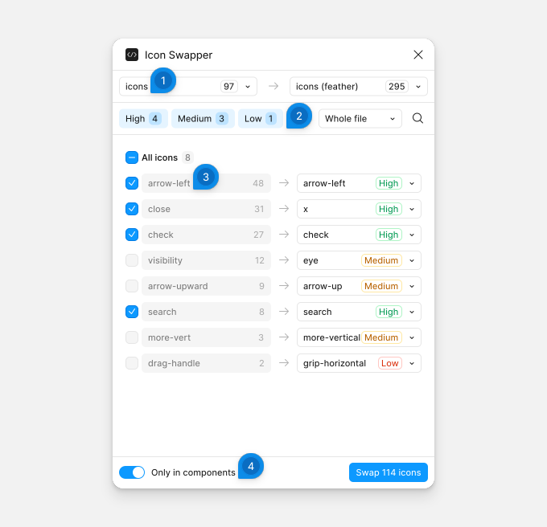

# Icon Swapper

Icon Swapper replaces the icons of one collection with the matching icons of another, for example Material icons with Feather icons. It matches the icons by name and lists every match for you to check before anything changes.

## Swap icons

The plugin reads the icon collections from a page whose name contains `icons`. Each frame on that page is one collection, and the icon components inside it are its icons. Both collections must be in the file.

1. **The collections** — the collection to replace on the left and the collection to use on the right, each with its number of icons.
2. **The toolbar** — **High**, **Medium** and **Low** show or hide the matches of each confidence. The dropdown sets where to swap: **Whole file**, **This page** or **Selection**. The search button filters the list by icon name.
3. **A match** — the icon to replace, with the number of places it is used, and the icon it becomes, with the confidence of the match. Click the icon to replace to select those layers. Open the dropdown to choose another icon: the suggestions come first, then every icon of the collection. Choosing an icon checks its row, and an icon you choose yourself shows **Picked**.
4. **Only in components** — swaps the icons inside your components only, and leaves the icons placed directly in frames.

The plugin checks the matches of high confidence for you. Check or clear the others, or use **All icons** for every row shown. Only the rows you can see are swapped, so a hidden confidence or a search leaves its rows as they are.

Click **Swap 114 icons** to replace every checked icon: the button counts the layers that change. Press Ctrl/Cmd+Z to undo.

Names match word by word. The plugin leaves out sizes such as `24` or `small`, and words that nearly every icon of a collection has, such as `icon`. It also knows a few pairs of synonyms, such as `close` and `x`, or `view` and `eye`.
